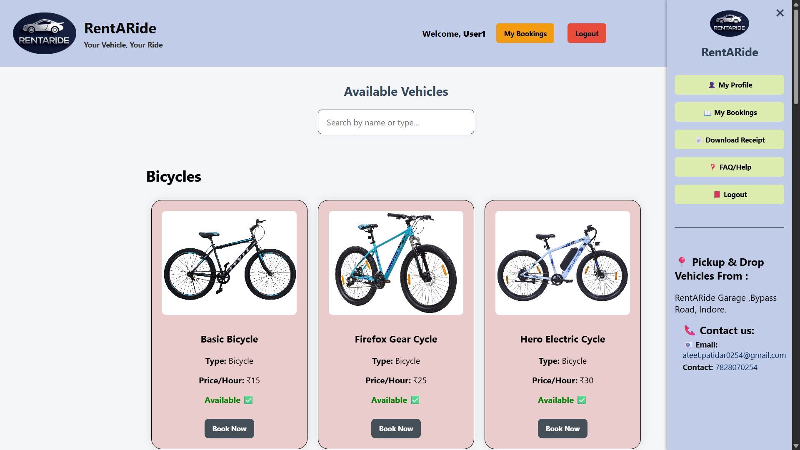
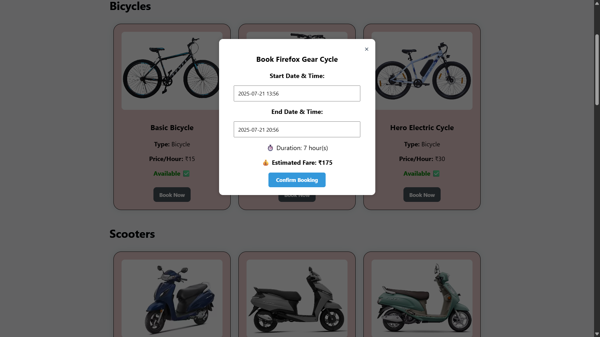
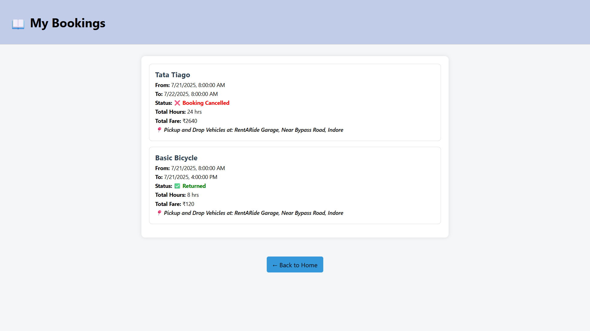
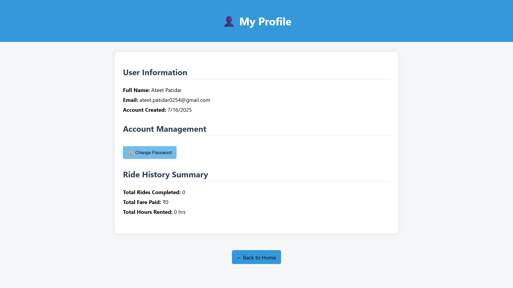
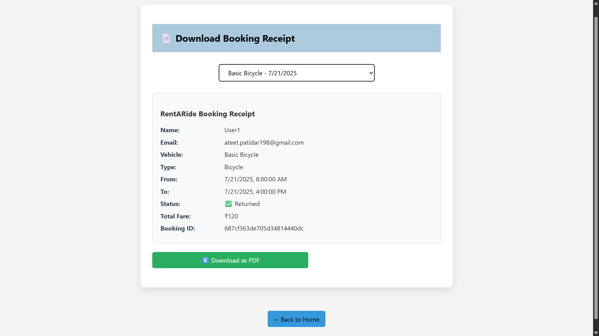
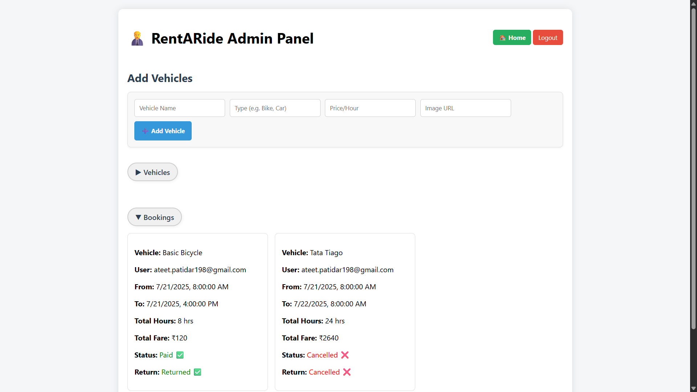

# RentARide

RentARide is a full-stack vehicle rental web application that allows users to easily rent bicycles, bikes, scooters, and cars. Admins can manage vehicles, users, and bookings through a secure dashboard.

---

## 📂 Folder Structure
vehicle-rental-website/
├── frontend/
│ ├── index.html, login.html, ...
│ └── script.js, style.css, images/
├── backend/
│ ├── routes/, models/, middleware/, utils/
│ └── server.js
├── .gitignore
├── README.md

---

## 🌟 Features

### ✅ User Features
- Register & Login (JWT-based)
- Forgot Password via OTP (Email)
- Browse & Filter Vehicles
- Real-time Availability-based Booking
- Razorpay Integration for Payments
- View My Bookings with:
  - Status: Paid, Unpaid, Returned, Cancelled
- Receipt/Invoice PDF download
- My Profile Page with:
  - Name, Email, Account Creation Date
  - Ride Summary (Hours, Fare, Rides)
  - Chnage Password

### ✅ Admin Features
- Secure Admin Login
- View All Vehicles (with type sorting)
- Add, Delete, Toggle Availability
- View All Users
- View All Bookings
  - Status: Paid/Unpaid
  - Mark Booking as Returned

### ✅ Core Functionalities
- Email Notifications (OTP, Confirmations)
- Responsive UI
- Custom Date & Time Pickers
- Secure APIs & Validation

---

## 🛠️ Tech Stack

| Category      | Tech Used                         |
|---------------|-----------------------------------|
| Frontend      | HTML, CSS, JavaScript             |
| Backend       | Node.js, Express.js               |
| Database      | MongoDB (Mongoose)                |
| Authentication| JWT                               |
| UI Components | Flatpickr (for datetime picker)   |
| Payments      | Razorpay                          |
| Email Service | Nodemailer                        |
| Version Ctrl. | Git & GitHub                      |

---

## 🚀 How to Run Locally

### ⚙️ Prerequisites
- Node.js installed
- MongoDB running locally or using MongoDB Atlas
- Nodemon installed: `npm install -g nodemon`

---

### ▶️ Backend Setup

bash
    cd backend
    npm install
    npx nodemon server.js

Ensure your .env file contains:
    PORT=5000
    MONGO_URI=your_mongodb_connection_string
    JWT_SECRET=your_jwt_secret
    EMAIL_USER=your_email@gmail.com
    EMAIL_PASS=your_email_password_or_app_pass
    RAZORPAY_KEY_ID=your_razorpay_key
    RAZORPAY_KEY_SECRET=your_razorpay_secret

🌐 Frontend
Open frontend/index.html in your browser

---

🛡️ Security Considerations
    Input validation (backend)
    OTP verification via email
    JWT tokens for user/admin access
    XSS & SQL Injection Protection

---
📸 Screenshots
    
    
    
    
    
    

---

👨‍💻 Developer
    Ateet Patidar
    Email: ateet.patidar0254@gmail.com

---
🏁 Status
    ✅ Project is complete and tested locally.

